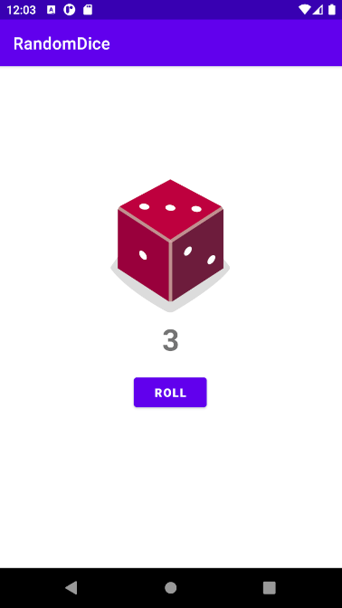

## Meu primeiro app em kotlin no Android Studio.
### Funções do App:
O app tem uma função bem simples, ele sorteia um numero randômico de um dado de seis faces.
### Interface:
O app contém apenas um botão, onde ao clicado exibi o numero sorteado em texto e na imagem do dado na face sorteada.
### Gif demostrativo do App em funcionando:
